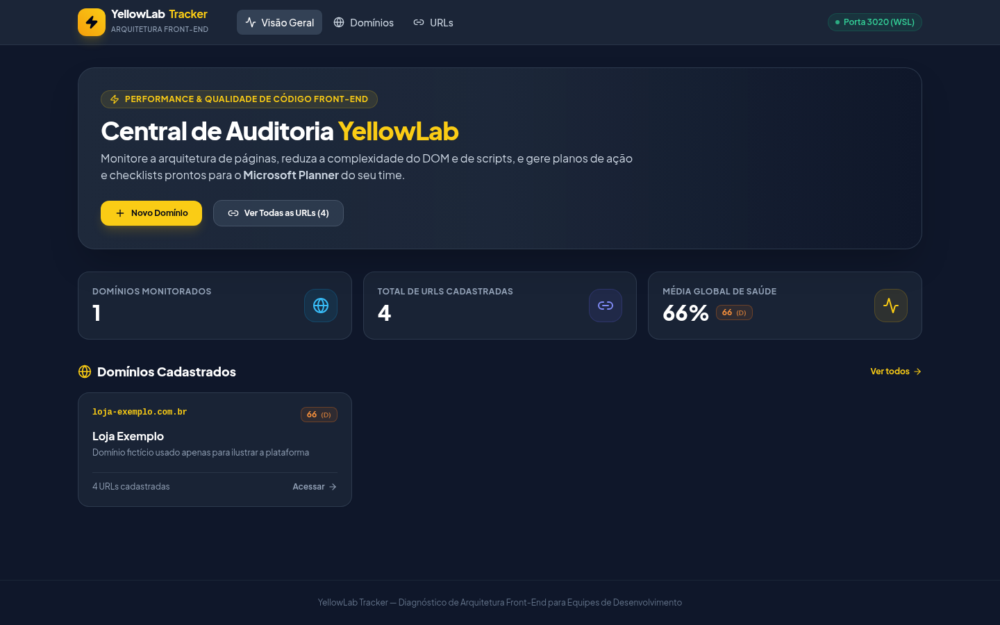
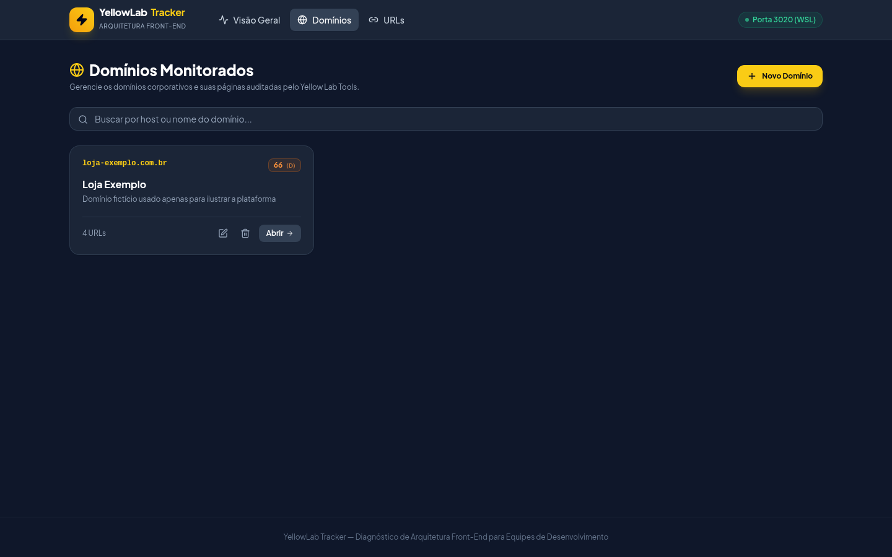
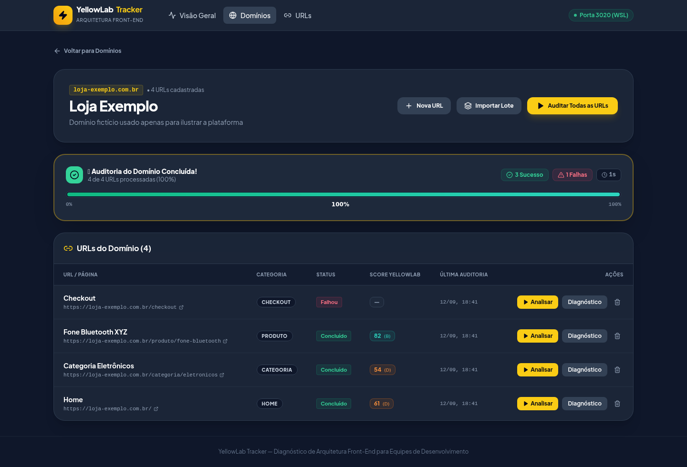
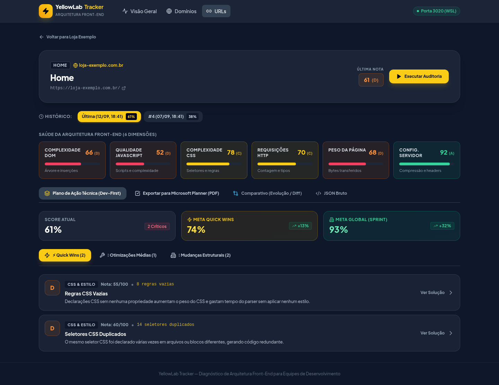
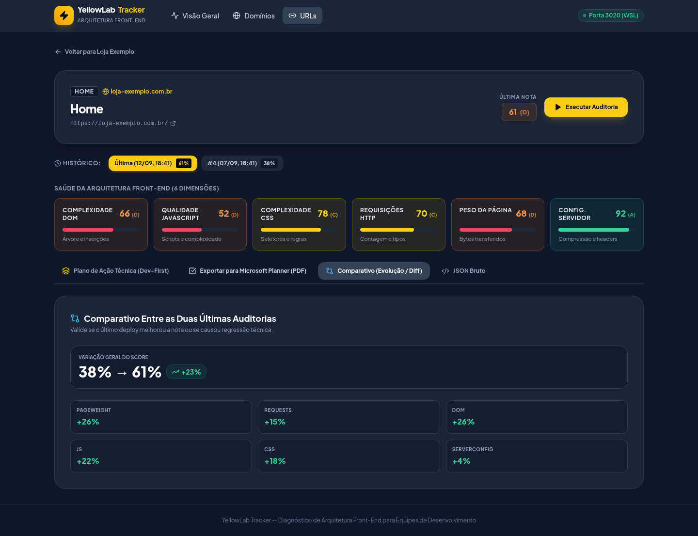
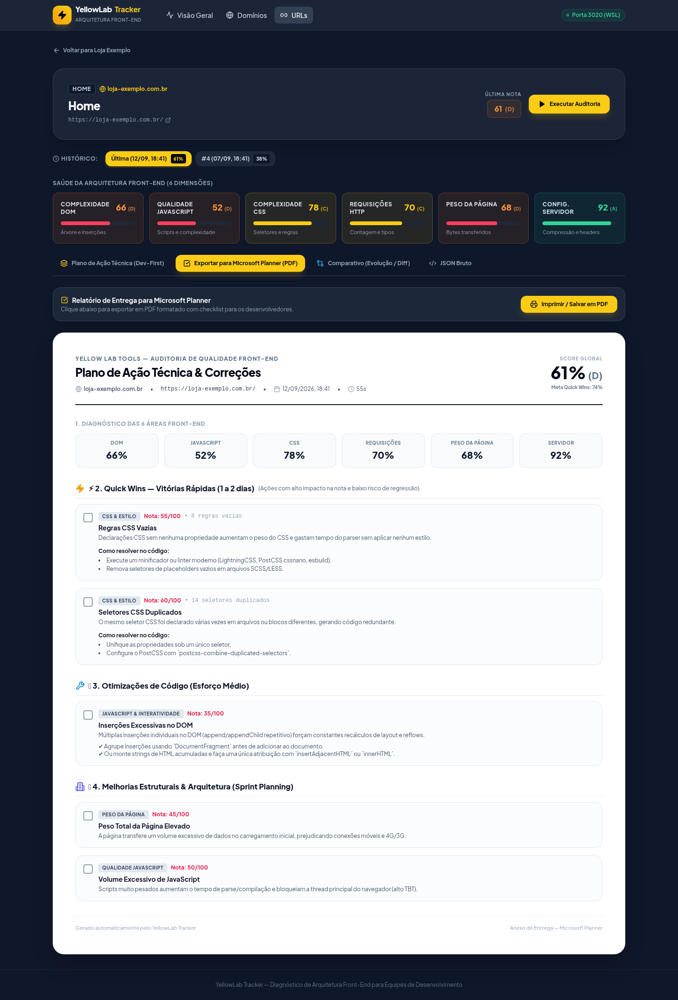

# ⚡ YellowLab Tracker — Auditoria Front-End para Desenvolvedores

Plataforma dedicada de diagnóstico técnico e arquitetura front-end baseada no **Yellow Lab Tools (v3.0.1)**, operando em contêineres Docker com foco absoluto em **clareza técnica, resolução ágil de problemas e exportação para o Microsoft Planner**.

> Versão atual: **v1.1.0** — veja o [CHANGELOG.md](CHANGELOG.md) para o histórico completo. O projeto segue [SemVer](https://semver.org/lang/pt-BR/): a versão vive em sincronia nos três `package.json` (raiz, `backend/`, `frontend/`) e cada PR mergeado em `master` deve vir com bump de versão + entrada no changelog.

---

## 🎯 Por que esta ferramenta existe?

Diferente de métricas genéricas de Lighthouse ou PageSpeed que apenas apontam notas sem contexto de código, o **YellowLab Tracker** realiza uma análise profunda da saúde do código-fonte da aplicação:
- **Complexidade do DOM:** Profundidade da árvore, inserções repetitivas no DOM e loops custosos.
- **Qualidade do JavaScript:** Scripts pesados, bloqueio da thread principal e chamadas síncronas.
- **Complexidade do CSS:** Seletores caros, declarações duplicadas e regras vazias.
- **Eficiência de Rede:** Contagem de requisições, cabeçalhos, ausência de compressão Gzip/Brotli e imagens pesadas.
- **Classificação por Esforço de Correção:** Separação automática entre **⚡ Quick Wins** (vitórias rápidas de 1-2 dias), **🛠️ Médio Esforço** e **🏗️ Mudanças Estruturais**.
- **Acompanhamento com Barra de Progresso em Tempo Real:** Visualização ao vivo do progresso das auditorias (percentual, contador de URLs processadas, URL atual sendo auditada e tempo decorrido).
- **Exportação para Microsoft Planner:** Geração de relatórios com checklist e trechos de código prontos para colar ou anexar em tarefas da equipe.

---

## 📸 Telas da Plataforma

> As telas abaixo usam dados fictícios (`loja-exemplo.com.br`) apenas para ilustração.

**Visão Geral (Dashboard)** — resumo dos domínios monitorados e média global de saúde.


**Domínios Monitorados** — listagem e busca dos domínios cadastrados.


**Detalhe do Domínio** — URLs cadastradas, status, score e progresso de auditoria em lote.


**Diagnóstico Dev-First** — as 6 dimensões de saúde e o plano de ação técnica (Quick Wins, Otimizações Médias, Mudanças Estruturais).


**Comparativo (Evolução / Diff)** — variação de score entre duas auditorias, para validar se um deploy melhorou ou piorou a nota.


**Exportação para Microsoft Planner (PDF)** — relatório formatado com checklist pronto para anexar em tarefas do time.


---

## 🛠️ Stack Tecnológica

| Camada | Tecnologia | Detalhes |
|---|---|---|
| **Orquestração** | Docker Compose | Containers isolados para aplicação e banco de dados |
| **Ambiente / OS** | Node.js 22 (Debian Bookworm) | Com Chromium headless e bibliotecas de renderização |
| **Backend API** | Fastify 4 + TypeScript | Respostas ultrarrápidas em memória (<10ms) |
| **Frontend UI** | Vite 6 + React 18 + Tailwind CSS | Compilação em 20ms e navegação instantânea |
| **Banco de Dados** | PostgreSQL 15 | Persistência de relatórios, histórico e métricas |
| **ORM** | Prisma ORM 5.22 | Tipagem estrita e migrações estruturadas |
| **Engine de Análise** | YellowLabTools 3.0.1 + Chromium | Auditoria real de renderização com `--no-sandbox` |

---

## 🔌 Mapeamento de Portas

Para evitar conflitos com outros serviços locais no WSL:
- **Aplicação Web (Frontend):** `http://localhost:3020`
- **Backend API:** `http://localhost:3021` (com proxy automático configurado no Vite)
- **PostgreSQL Host:** `localhost:5435` (interno no container: `5432`)

---

## 🚀 Como Executar o Projeto (Passo a Passo no WSL)

### 1. Pré-requisitos
- Docker e Docker Compose instalados e rodando.
  - No Windows/WSL2: Docker Desktop com a integração WSL2 habilitada para a sua distribuição.
  - No Linux/macOS: Docker Engine (ou Docker Desktop) com o plugin `docker compose`.

### 2. Clonar o Projeto
No terminal do WSL:
```bash
git clone <url-do-repositorio>
cd yellowlab-tracker
```

### 3. Configurar as Variáveis de Ambiente
Copie o arquivo de exemplo (os valores padrão já funcionam com o `docker-compose.yml`):
```bash
cp .env.example .env
```

### 4. Subir os Contêineres Docker
Execute o build e inicialize os serviços em segundo plano:
```bash
docker compose up -d --build
```
> O primeiro build pode levar alguns minutos (instala Chromium + dependências dos 3 `package.json`). As migrações do Prisma são aplicadas **automaticamente** ao subir o backend — não é preciso rodar nenhum comando manual de migração.

### 5. Acessar a Aplicação
Abra no seu navegador:
👉 **[http://localhost:3020](http://localhost:3020)**

---

## 📖 Guia de Uso para o Time de Desenvolvimento

### 1. Cadastrando um Domínio
1. Na tela inicial ou em **Domínios**, clique em **Novo Domínio**.
2. Preencha o host principal (ex: `minhaloja.com.br`) e o rótulo do projeto.
3. Salve para criar o agrupador de páginas.

### 2. Adicionando URLs (Individual ou em Massa)
- **Individual:** Dentro do domínio, clique em **Nova URL** e insira a página com sua respectiva categoria (Home, Categoria, Produto, Checkout, etc.).
- **Em Massa (Lote):** Clique em **Importar Lote** e cole uma lista de 10, 20 ou mais URLs (uma por linha). A ferramenta ignora duplicidades e cadastra tudo em lote instantaneamente.

### 3. Disparando Auditorias
- **Auditoria de URL Específica:** Clique no botão **Analisar** ao lado de qualquer link. O Chromium headless carregará a página e gerará a pontuação em segundos.
- **Auditoria em Massa do Domínio:** Clique em **Auditar Todas as URLs** no cabeçalho do domínio para rodar a fila sequencialmente em segundo plano.

### 4. O Diagnóstico Dev-First (Raio-X da Página)
Ao clicar em **Diagnóstico** em uma URL auditada, você verá:
1. **As 6 Dimensões de Saúde:** Indicadores de DOM, JavaScript, CSS, Requisições, Peso e Servidor.
2. **Abas de Prioridade de Ação:**
   - **⚡ Quick Wins:** Correções rápidas com alta relação custo/benefício (ex: adicionar `font-display: swap`, ativar Brotli/Gzip, remover seletores vazios).
   - **🛠️ Otimizações Médias:** Refatorações de scripts, uso de `DocumentFragment` e redução de consultas repetidas ao DOM.
   - **🏗️ Mudanças Estruturais:** Gargalos de template e árvores de nós DOM excessivamente profundas.
3. **Inspecionar Ofensores:** Modal detalhado com o nome exato dos arquivos `.js`, `.css`, nós do DOM ou seletores problemáticos, com botão de copiar em 1 clique e guia **Como Corrigir** com snippets de código prontos.

### 5. Exportando para o Microsoft Planner (PDF)
1. Na tela de diagnóstico da URL, selecione a aba **Exportar para Microsoft Planner (PDF)**.
2. Você verá um documento diagramado profissionalmente, com cabeçalho da tarefa, radar das 6 áreas e um checklist completo `[ ]` com as correções necessárias.
3. Clique no botão **Imprimir / Salvar em PDF** para gerar o arquivo `.pdf` e anexá-lo diretamente aos cards de tarefas e sprints do Microsoft Planner do time.

### 6. Validando Entregas com o Comparador (Diff)
Após o time subir uma correção no ambiente de staging/produção:
1. Execute uma nova auditoria na mesma URL.
2. Abra a aba **Comparativo (Evolução / Diff)**.
3. O sistema calcula a diferença exata (ex: `+18% de ganho global`, `+30% no DOM`) para comprovar o sucesso da entrega técnica.

---

## 💻 Auditoria Direta via Linha de Comando (CLI)

Os desenvolvedores podem auditar qualquer URL diretamente pelo terminal enquanto testam alterações locais:

```bash
docker compose exec app npm run audit https://meusite.com.br/pagina mobile
```

A ferramenta exibirá o resumo no próprio terminal, listando os Quick Wins e os ofensores identificados.

---

## ⚙️ Variáveis de Ambiente Avançadas

Todas opcionais — a ferramenta funciona sem elas, com os padrões abaixo:

| Variável | Padrão | Para que serve |
|---|---|---|
| `MAX_CONCURRENT_AUDITS` | `1` | Quantas auditorias (Chromium) rodam de fato em paralelo. O padrão é 1 porque testamos 2 num ambiente Docker/WSL2 local e o Chromium ficou instável (`Target closed`). Só aumente se sua máquina tiver CPU/memória de sobra. |
| `AUDIT_MAX_RETRIES` | `1` | Quantas vezes uma auditoria que falhou por motivo transitório (rede, crash pontual do Chromium) é tentada de novo automaticamente antes de marcar `FAILED`. `0` desativa o retry. |
| `AUDIT_RETRY_DELAY_MS` | `3000` | Intervalo entre tentativas, em milissegundos. |
| `REPORTS_DIR` | `<raiz do projeto>/ylt_reports` | Onde o JSON completo de cada auditoria é salvo em disco (ver seção abaixo). |

### 📁 Onde ficam os relatórios completos

O JSON completo de cada auditoria (`scoreProfiles`, `rules`, ofensores — pode passar de alguns MB) **não fica no Postgres**. Ele é salvo em arquivos locais na pasta `ylt_reports/` na raiz do projeto (um subdiretório por URL, `ylt_reports/url-<id>/`), fora do controle de versão (já está no `.gitignore`). O banco guarda só os scores resumidos e o caminho do arquivo. Excluir uma URL ou um domínio também remove os relatórios correspondentes em disco.

> No Linux, como o container roda como root, os arquivos dentro de `ylt_reports/` ficam com dono `root` no host — para apagar a pasta manualmente pode ser preciso `sudo rm -rf ylt_reports/`.

---

## 🔧 Comandos Frequentes

| Ação | Comando |
|---|---|
| **Subir contêineres** | `docker compose up -d` |
| **Parar contêineres** | `docker compose down` |
| **Ver logs da aplicação** | `docker compose logs -f app` |
| **Reconstruir contêineres** | `docker compose up -d --build` |
| **Acessar o terminal da aplicação** | `docker compose exec app bash` |
| **Acessar o banco PostgreSQL** | `docker compose exec db psql -U user -d ylt_tracker` |
| **Aplicar migrações pendentes** | `docker compose exec app npm --prefix backend run prisma:migrate` |
| **Criar uma nova migração (dev)** | `docker compose exec app npm --prefix backend run prisma:migrate:dev` |
| **Visualizar banco com Prisma Studio**| `docker compose exec app npx --prefix backend prisma studio --port 5555` |

---

## 🛡️ Solução de Problemas Comuns

- **Erro de Chromium Sandbox:** O container já vem configurado com o wrapper `/usr/local/bin/chromium-no-sandbox` (flags `--no-sandbox --disable-gpu` e afins). Nunca remova essas flags em ambiente Docker. O `docker-compose.yml` também define `shm_size: 2gb` para evitar crashes do Chromium por falta de memória compartilhada — não reduza esse valor.
- **Auditoria falha com "Target closed" / timeout:** sites reais podem levar bem mais que alguns segundos para serem totalmente auditados. O timeout do YellowLabTools em [backend/src/lib/ylt-runner.ts](backend/src/lib/ylt-runner.ts) está em 90s; se você auditar sites muito pesados e continuar vendo timeout, aumente esse valor. Falhas transitórias já são retentadas automaticamente (`AUDIT_MAX_RETRIES`, ver seção de variáveis de ambiente acima).
- **Porta 3020 já em uso:** Caso a porta 3020 esteja ocupada por outro serviço no seu sistema, altere a variável `PORT` no arquivo `.env` e no `docker-compose.yml`.
- **Banco de dados não conecta:** Verifique se o container `db` está saudável rodando `docker compose ps`. A porta externa do banco é `5435` para não colidir com o Postgres padrão (`5432`) ou de outros projetos (`5438`, `5439`).
